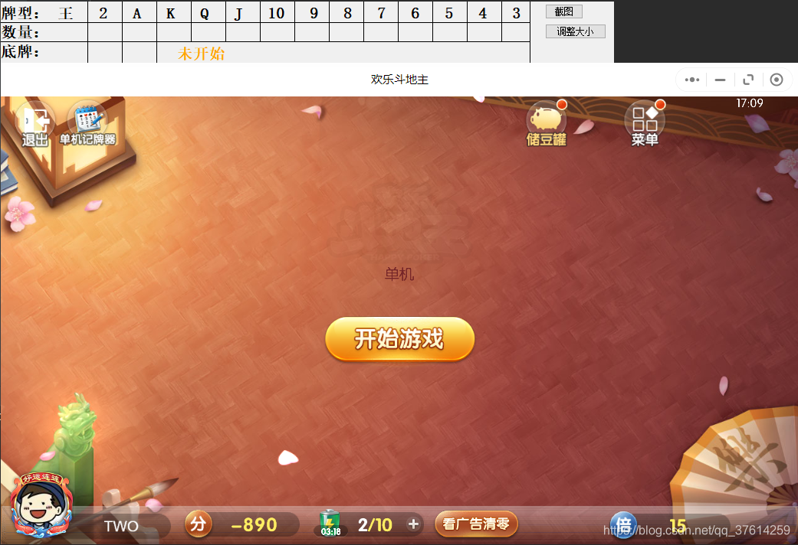
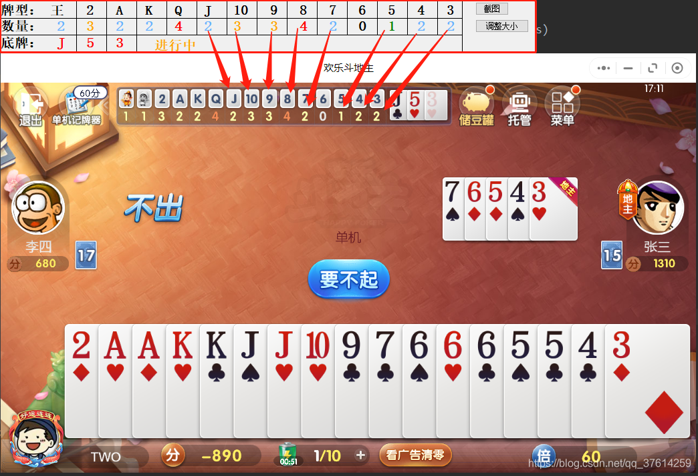
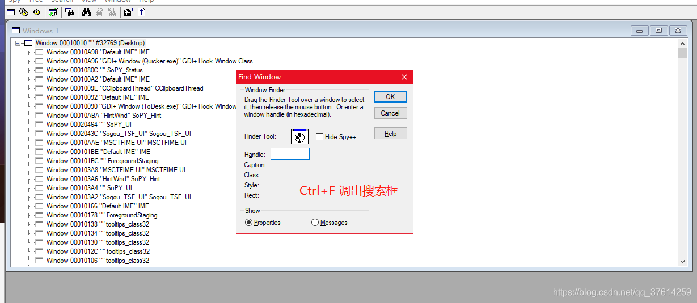
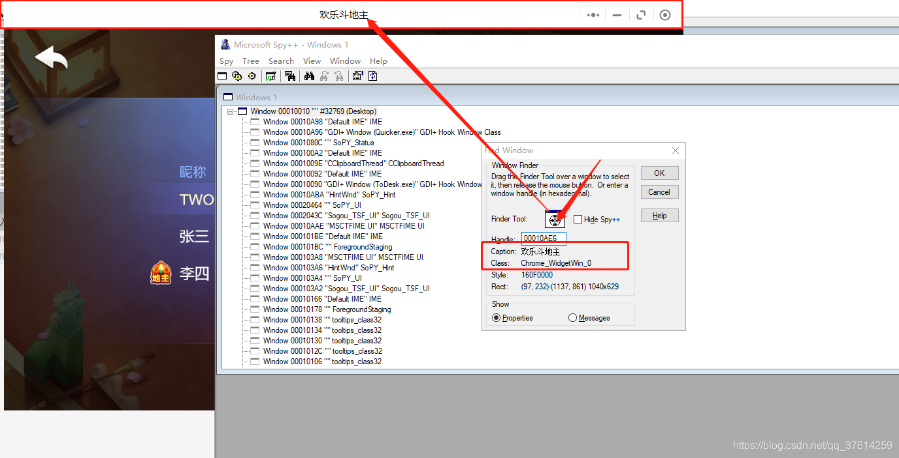
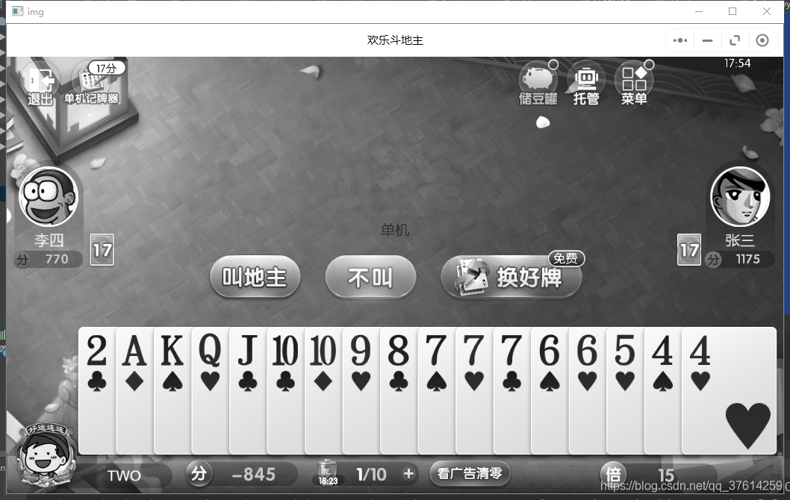
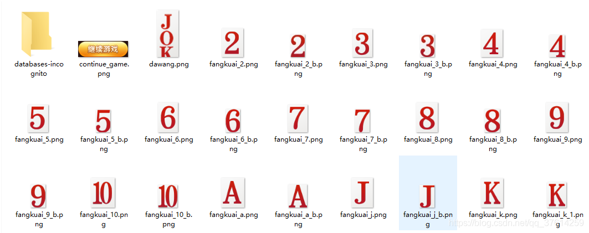

# 基于opencv的模板匹配制作的 记牌器

> !!！新版更改了截图方式（旧版截图会出现黑屏），新版截图有一点不太清晰，准确的有所下降!!!

> !!！新版更改了截图方式（旧版截图会出现黑屏），新版截图有一点不太清晰，准确的有所下降!!!

> !!！新版更改了截图方式（旧版截图会出现黑屏），新版截图有一点不太清晰，准确的有所下降!!!
 

> 基于python opencv的模板匹配制作的记牌器

> 实现思路，通过python win32获取小程序的窗口句柄，然后后台自动截屏，针对每屏进行扑克牌匹配，实现识别开局，自家扑克、底牌、上下家出牌识别，记录对局剩余扑克，自动识别游戏结束，重新统计对局

## 已实现功能

## 功能截图

## 功能视频演示

<https://v.qq.com/x/page/f32310hayxb.html>

记牌器演示 学习

## 仓库地址

[gitee](https://gitee.com/css_code/happy-fight-opencv.git "gitee"):[https://gitee.com/css\_code/happy-fight-opencv.git](https://gitee.com/css_code/happy-fight-opencv.git "https://gitee.com/css_code/happy-fight-opencv.git")

## 技术栈

-   python
-   PyQt5
-   win32gui
-   cv2

## 安装

# 安装 opencv 使用清华镜像下载

pip install python-opencv -i [https://pypi.tuna.tsinghua.edu.cn/simple](https://pypi.tuna.tsinghua.edu.cn/simple "https://pypi.tuna.tsinghua.edu.cn/simple")

pip install win32gui -i [https://pypi.tuna.tsinghua.edu.cn/simple](https://pypi.tuna.tsinghua.edu.cn/simple "https://pypi.tuna.tsinghua.edu.cn/simple")

## 进入正题

思考： &#x20;
1、python 如何截屏指定窗口？ &#x20;
2、想要截图的窗口不在顶层，肉眼不可见怎么办呢？

### 查看想要截图的窗口句柄

### 获取游戏截图

import win32gui, win32ui, win32con

import cv2

import numpy as np

def screen():

hWnd = win32gui.FindWindow(None, "欢乐斗地主")

left, top, right, bot = win32gui.GetWindowRect(hWnd)

width = right - left

height = bot - top

# 窗口隐藏或最小化，无法截图

if top < 0:

return None

# 返回句柄窗口的设备环境，覆盖整个窗口，包括非客户区，标题栏，菜单，边框

hWndDC = win32gui.GetWindowDC(hWnd)

# 创建设备描述表

mfcDC = win32ui.CreateDCFromHandle(hWndDC)

# 创建内存设备描述表

saveDC = mfcDC.CreateCompatibleDC()

# 创建位图对象准备保存图片

saveBitMap = win32ui.CreateBitmap()

# 为bitmap开辟存储空间

saveBitMap.CreateCompatibleBitmap(mfcDC, width, height)

# 将截图保存到saveBitMap中

saveDC.SelectObject(saveBitMap)

saveDC.BitBlt((0, 0), (width, height), mfcDC, (0, 0), win32con.SRCCOPY)

# 保存截图

# saveBitMap.SaveBitmapFile(saveDC, "img\_Winapi.bmp")

signedIntsArray = saveBitMap.GetBitmapBits(True)

img = np.fromstring(signedIntsArray, dtype='uint8')

img.shape = (height, width, 4)

# 保存bitmap到内存设备描述表

img = cv2.resize(img, (1040, 629), interpolation=cv2.INTER\_CUBIC)

img = cv2.cvtColor(img, cv2.COLOR\_BGRA2RGB)

# cv2.imwrite('screen.png', img)

# 返回一张可以给opencv 使用的图片

return img

# 调用截图方法，获取截图结果

img = screen()

# 转为灰色通道的图片

img\_gray = cv2.cvtColor(img, cv2.COLOR\_BGR2GRAY)

# 显示图片

cv2.imshow('img', img\_gray)

# 任意键退出

cv2.waitKey(0)

运行效果： &#x20;

### 截取感兴趣区域

# 调用截图方法，获取截图结果

img = screen()

# 转为灰色通道的图片，截取自己的出牌区域

img\_gray = cv2.cvtColor(img, cv2.COLOR\_BGR2GRAY)\[350:622, 10:1042]

# 显示图片

cv2.imshow('img', img\_gray)

# 任意键退出

cv2.waitKey(0)

运行效果： &#x20;

### 第三步，模板匹配

运行效果： &#x20;
匹配出结果 4 &#x20;

## 仓库地址

[gitee](https://gitee.com/css_code/happy-fight-opencv.git "gitee"):[https://gitee.com/css\_code/happy-fight-opencv.git](https://gitee.com/css_code/happy-fight-opencv.git "https://gitee.com/css_code/happy-fight-opencv.git")

## 下载尝鲜

git仓库中上传了成品文件，下载即可体验

ok，目前为止我们已经可以准确识别出自己的卡牌和数量，下一篇文章中我们将继续演示识别其他玩家的出牌和地板，以及剩余的扑克，和出牌过程中的动态修改剩余纸牌数量

模板文件我已经整理好，在代码仓库中

# 模板匹配方法

def matchImgNum(bgImg, templeteImg, threshold=0.92):

'''

bgImg：截图出来的底片

templeteImg；模板图片

threshold：对比精确度

'''

res = cv2.matchTemplate(bgImg, templeteImg, cv2.TM\_CCOEFF\_NORMED)

tt = bgImg.copy()

w, h = templeteImg.shape\[::-1]

loc = np.where(res >= threshold)

num = 0

if len(loc\[0]) != 0:

last = 0

# 排序

loc\[1].sort()

for point in loc\[1]:

if abs(last - point) > 5:

num += 1

# if save:

# print(save)

for pt in zip(\*loc\[::-1]):

cv2.rectangle(tt, pt, (pt\[0] + w, pt\[1] + h), (0, 0, 255), 2)

cv2.imwrite('res223.png', tt)

last = point

return num

# 调用截图方法，获取截图结果

img = screen()

# 转为灰色通道的图片，截取自己的出牌区域

img = cv2.cvtColor(img, cv2.COLOR\_BGR2GRAY)\[350:622, 10:1042]

# 读取 模板， 扑克4

temp = cv2.imread('templete/fangkuai\_10.png', 0)

num = matchImgNum(img, temp, 0.85)

print('匹配出结果', num)

拖动Finder Tool 工具到目标窗口，得到窗口句柄caption和class，这里咱们主要用到 caption

